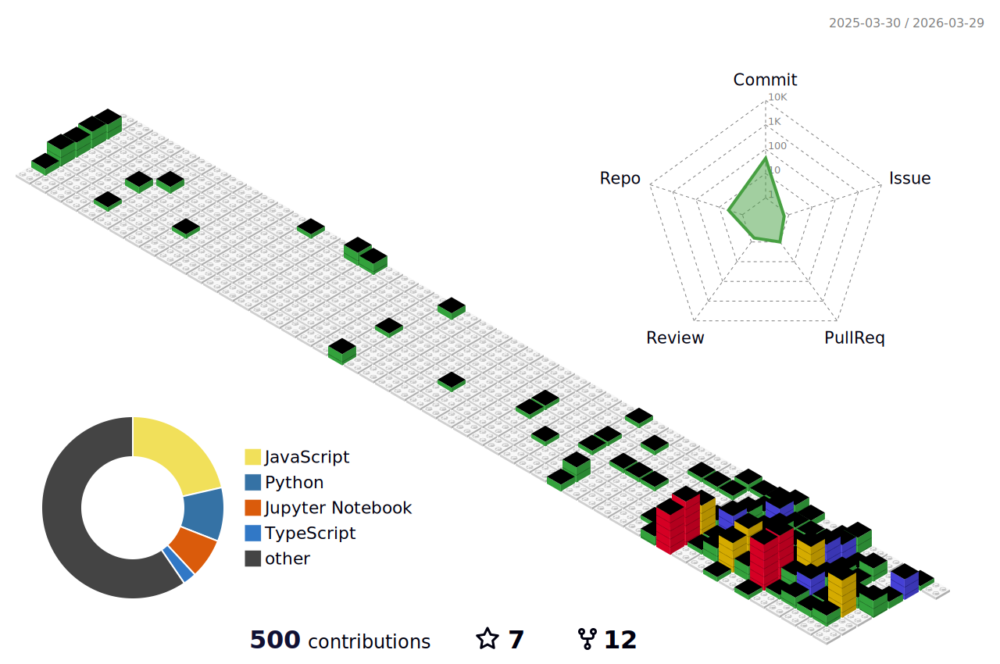

### Hi there 👋

<!-- - 🔭 I’m currently working on ...
- 🌱 I’m currently learning ...
- 👯 I’m looking to collaborate on ...
- 🤔 I’m looking for help with ...
- 💬 Ask me about ...
- 📫 How to reach me: ... -->
  

<h1 align="center"></h1>

  
    
  
  

<!-- lib
https://github.com/marketplace/actions/github-profile-3d-contrib -->
